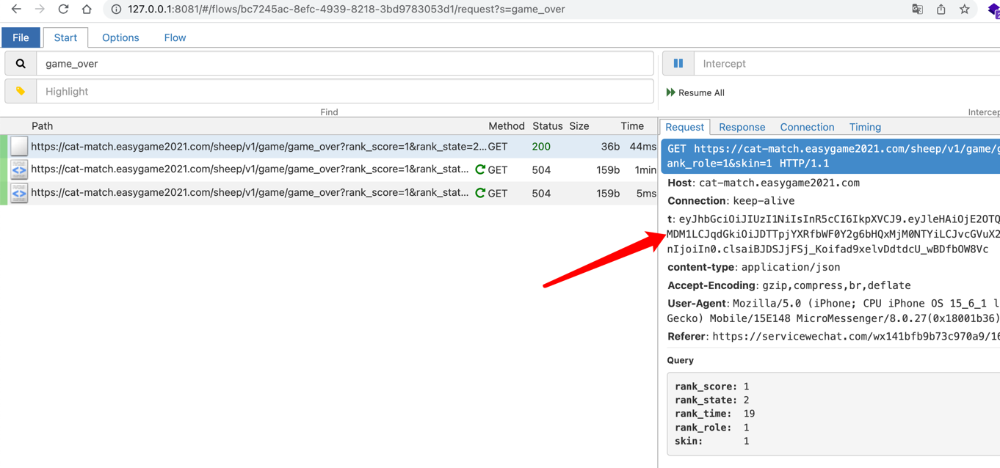

# sheep-a-sheep
羊了个羊小工具

token自己通过mitmproxy抓包获取

` pip install -r requirements.txt`

## 刷排名
`python sheep_rank.py`

## 弱化羊了个羊

`mitmdump -p 9988 -s sheep.py `

要求在同一个wifi网络下  开启手机代理 你的ip 端口9988 ，至于手机怎么装证书自己百度。